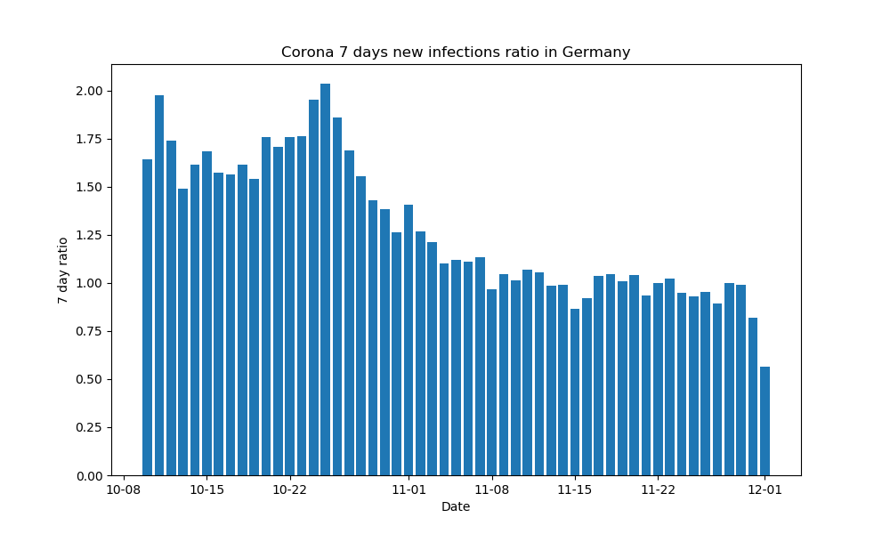

# This repo provides a small script to visualize the Corona 7 days infections ratio

## How to read the plot
A bar for a date e.g. the 10-17 is calculated as follows:
(total_infections_on_10-17 / total_infections_on_10-10)

This result provides a ratio to compare the infection rate from the previous 
week on the same day. For example, fewer cases are reported 
at the weekend than during the week.

## How to run the script
``
python visualize_infections_ratio.py
``
 